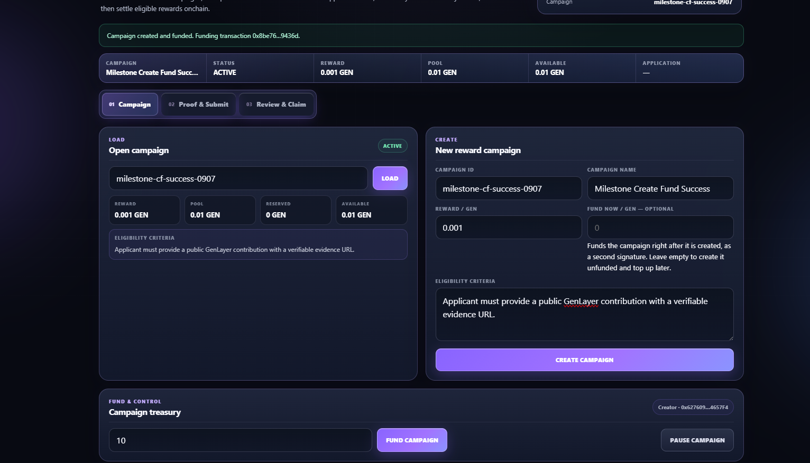
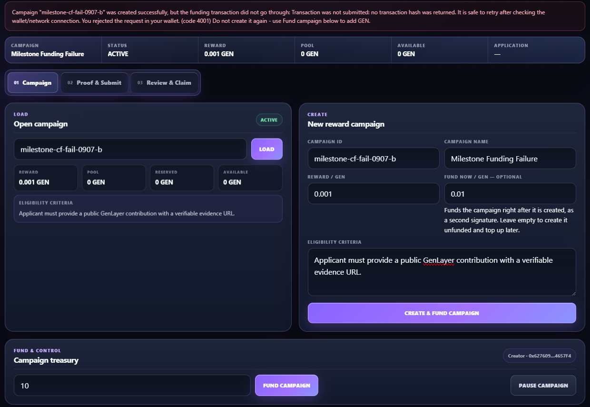

# AirJudge Milestone v1 — Create & Fund Runtime Evidence

Date: 2026-09-07

## Scope

This milestone changes the dApp flow only. The deployed Intelligent Contract is unchanged:

- StudioNet contract: `0x29c49872d34361FdC72C0528f7fCeB97F1eeda95`
- Explorer: https://explorer-studio.genlayer.com/address/0x29c49872d34361FdC72C0528f7fCeB97F1eeda95

The create form can optionally collect an initial GEN amount. When present, the dApp executes two ordered writes as one user flow:

1. `create_campaign`
2. confirm the campaign exists on-chain
3. `fund_campaign`

The funding write is never attempted before campaign creation is confirmed.

## Runtime Case A — Create + Fund succeeds

Campaign ID:

```text
milestone-cf-success-0907
```

Observed result:

```text
Status:    ACTIVE
Reward:    0.001 GEN
Pool:      0.01 GEN
Reserved:  0 GEN
Available: 0.01 GEN
```

The UI displayed `Campaign created and funded` and then loaded the campaign from on-chain state with the funded pool visible.

Evidence screenshot:



## Runtime Case B — Campaign creation succeeds, funding is rejected

Campaign ID:

```text
milestone-cf-fail-0907-b
```

The first write (`create_campaign`) succeeded. The second wallet request for `fund_campaign` was deliberately rejected by the user. The dApp reported the wallet rejection (`code 4001`) and explicitly warned not to recreate the campaign.

Observed post-state:

```text
Status:    ACTIVE
Reward:    0.001 GEN
Pool:      0 GEN
Reserved:  0 GEN
Available: 0 GEN
```

The campaign remained loadable and the standalone **Fund Campaign** recovery control remained available. No funding transaction hash exists for this case because the wallet rejected the request before submission.

Evidence screenshot:



## What the evidence proves

- The optional initial-funding path works end-to-end when both writes succeed.
- `fund_campaign` is ordered after confirmed campaign creation.
- A failure to submit the funding leg does not erase or duplicate the already-created campaign.
- The partial-success state is explicit to the user instead of being presented as a generic failure.
- Recovery uses the existing standalone **Fund Campaign** action rather than retrying `create_campaign`.

## Important interpretation

Case B is a wallet-rejection / transaction-not-submitted scenario, not a contract revert. The evidence does not claim otherwise.
